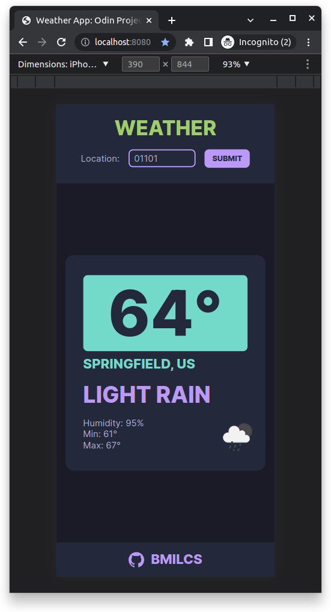
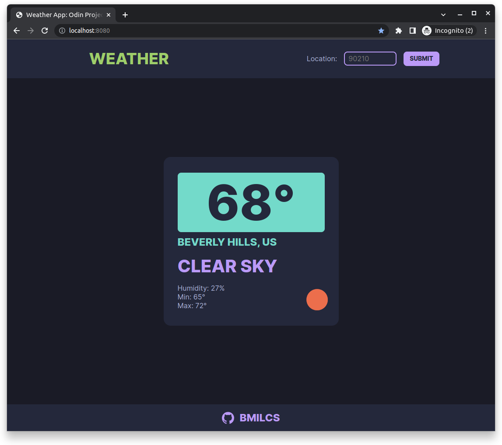

# Odin Project #12: Weather App

Welcome to Bryan Miller's Weather App Project, the [twelth assignment](https://www.theodinproject.com/lessons/node-path-javascript-weather-app) within the Odin Project curriculum. The goal of this repo is to practice the following skill sets:

- APIs
- Asynchronous JavaScript
  - `async/await`
  - `fetch`
  - Promises
- npm
  - webpack split config
  - ESLint
  - Airbnb JavaScript
  - Prettier
- SASS

## Summary

Now we're cookin'... with the introduction of Asychronous JavaScript! The topic of weather doesn't excite me so I opted to go with a simpler, minimalist approach to this assignment.

With the help of `openweathermap.org`, this basic app accepts a zip code for input and displays the current weather for that location on the page.

Following the SOLID design principals, I broke the code into three modules:

- `app.js (APP)` handles the logic & flow of the application
- `api.js (API)` fetches the external data, parses the json & returns an object
- `ui.js (UI)` handles all of the DOM manipulation & rendering of elements

My weather app begins with `index.js` and it gets the ball rolling by calling `APP.start()`.

From there, `start()` calls functions in the `ui.js` module to render the layout of the page & the form. It then triggers `changeLocation()`, the core function in this app, and passes in a zip code of `90210` as a default parameter.

`changeLocation()` is an asynchronous function that calls `getWeatherByZipCode()`, located in the `api.js` module, and awaits a response.

`getWeatherByZipCode()` uses the `fetch` API to reach out to `openweathermap` and if an error or invalid zip code is provided, it returns nothing back to `changeLocation()`.

- If nothing is returned, `UI.displayError()` adds an `error` class to the `SUBMIT` button, displaying the `:after` pseudo-element, containing a generic zip code not found error.
- If `response.ok` is the result of the `fetch` API call, the previous weather element is cleared & the parsed JSON is passed to a function called `processRawData()`. This function instantiates a new `Weather` object using the `Weather` class. Its constructor function extracts the important key/value pairs, formats the temperatures with the `formatTemp()` method and it's then returned back to the original `changeLocation()` function call. Lastly, the returned object is passed as a argument to `UI.renderWeather()` and it's displayed on the page.

### `containerize` & `makeElement` Modules

This is _yet another_ project that I'ved built using my `makeElement` and `containerize` utility modules. As simple as they are, they've significantly reduced the amount of code I've had to write.

While `makeElement` is self expalanatory and pretty basic, `containerize` is not. I wrote up a detailed explanation in my Todo List README, [located here](https://github.com/bmilcs/odin-todo-list#what-is-containerize).

## Links

- [Live Demo](https://bmilcs.github.io/odin-weather-app/)
- [My Odin Project Progress](https://github.com/bmilcs/odin-project)

## Screenshots

> Mobile



> Desktop



## Deployment

```sh
# clone repo
git clone https://github.com/bmilcs/odin-weather-app.git

# install dev dependencies
cd odin-weather-app
npm install --save-dev \
  webpack webpack-cli webpack-dev-server webpack-merge \
  html-webpack-plugin style-loader css-loader sass-loader sass \
  eslint eslint-config-prettier
```
